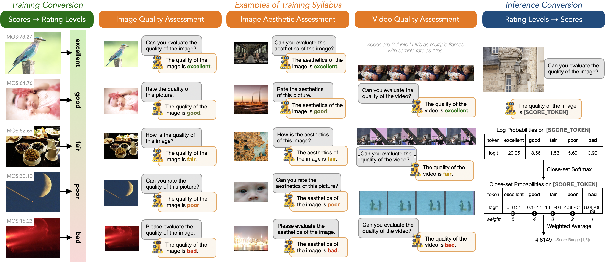

<div align="center">
  <h1>Q-Align: Teaching LMMs for Visual Scoring via Discrete Text-Defined Levels</h1> 
    
*One Unified Model for Image Quality Assessment (IQA), Image Aesthetic Assessment (IAA), and Video Quality Assessment (VQA).*
    
<div style="width: 75%; text-align: center; margin:auto;">
      
</div>
</div> 

<div style="width: 100%; text-align: center; margin:auto;">
      
</div>
</div> 


## Installation

If you only need to infer (or evaluate):

```shell
git clone https://github.com/Q-Future/Q-Align.git
cd Q-Align
pip install -e .
```

For training, you need to further install additional dependencies as follows:

```shell
pip install -e ".[train]"
pip install flash_attn --no-build-isolation
```

## Quick Start

### Image Quality Scorer

- CLI Interface

```shell
export DEFAULT_IMG_PATH=fig/singapore_flyer.jpg
python q_align/evaluate/scorer.py --img_path $DEFAULT_IMG_PATH
```

- Python API

```python
from q_align.evaluate.scorer import QAlignScorer
from PIL import Image

scorer = QAlignScorer()
img_list = [Image.open("fig/singapore_flyer.jpg")] # can be multiple images
print(scorer(img_list).tolist())
```

### Image Aesthetic Scorer

- CLI Interface

```shell
export DEFAULT_IMG_PATH=fig/singapore_flyer.jpg
python q_align/evaluate/scorer.py --img_path $DEFAULT_IMG_PATH --aesthetic --model-path q-future/one-align
```

- Python API

```python
from q_align.evaluate.scorer import QAlignAestheticScorer
from PIL import Image

scorer = QAlignAestheticScorer()
img_list = [Image.open("fig/singapore_flyer.jpg"), Image.open("fig/boy_colorful.png")] # can be multiple images
print(scorer(img_list).tolist())
```


### Video Quality Scorer

- CLI Interface

```shell
export DEFAULT_IMG_PATH=fig/baby.mp4
python q_align/evaluate/scorer.py --img_path $DEFAULT_IMG_PATH --video --model-path q-future/one-align
```

- Python API

```python
from q_align.evaluate.scorer import QAlignVideoScorer, load_video

scorer = QAlignVideoScorer()
video_list = [load_video("fig/baby.mp4")]
print(scorer(video_list).tolist())
```


## Training & Evaluation

### Get Datasets

Download all datasets needed together.

```python
import os, glob
from huggingface_hub import snapshot_download


snapshot_download("q-future/q-align-datasets", repo_type="dataset", local_dir="./playground/data", local_dir_use_symlinks=False)

gz_files = glob.glob("playground/data/*.tar")

for gz_file in gz_files:
    print(gz_file)
    os.system("tar -xf {} -C ./playground/data/".format(gz_file))
```

For LSVQ, (video quality dataset, optional), you can download as follows:

```python
import os, glob
from huggingface_hub import snapshot_download

snapshot_download("teowu/LSVQ-videos", repo_type="dataset", local_dir="./playground/data/lsvq/", local_dir_use_symlinks=False)

gz_files = glob.glob("playground/data/lsvq/*.tar.gz")

for gz_file in gz_files:
    print(gz_file)
    os.system("tar -xzf {} -C ./playground/data/lsvq/".format(gz_file))
```

### Evaluation

After preparing the datasets, you can evaluate pre-trained **OneAlign** as follows:

- Image Quality Assessment (IQA)

```shell
python q_align/evaluate/iqa_eval.py --model_path q-future/one-align --device cuda:0
```

- Image Aesthetic Assessment (IAA)

```shell
python q_align/evaluate/iaa_eval.py --model_path q-future/one-align --device cuda:0
```

- Video Quality Assessment (VQA)

```shell
python q_align/evaluate/vqa_eval.py --model_path q-future/one-align --device cuda:0
```

We will release other pre-trained checkpoints soon.


### Training

#### Image Quality Assessment

- Training Q-Align with KonIQ-10k:

```shell
sh scripts/l1_koniq.sh
```

- Training Q-Align with mixture of KonIQ-10k, SPAQ, and KADID-10k:

```shell
sh scripts/iqa_mix.sh
```

#### Image Aesthetic Assessment

- Training Q-Align Aesthetic Predictor with AVA dataset:

```shell
sh scripts/l1_ava.sh
```

#### Video Quality Assessment

- Training Q-Align Aesthetic Predictor with AVA dataset:

```shell
sh scripts/l1_lsvq.sh
```

*At least 4\*A6000 GPUs or 2\*A100 GPUs will be enough for the training.*

#### *OneAlign*

- Training OneAlign with IQA datasets, AVA dataset (IAA) and LSVQ dataset (VQA):

```shell
sh scripts/all_.sh
```

*At least 8\*A6000 GPUs or 4\*A100 GPUs will be enough for the training.*

#### Contact

Please contact any of the first authors of this paper for queries.

- Haoning Wu, haoning001@e.ntu.edu.sg, @teowu
- Zicheng Zhang, zzc1998@sjtu.edu.cn, @zzc-1998

#### Acknowledgements

We sincerely thank Dr Weixia Zhang (@onionbao) and Dr Chaofeng Chen (@chaofenghust) for assistance on experiments and advice on this project. 

