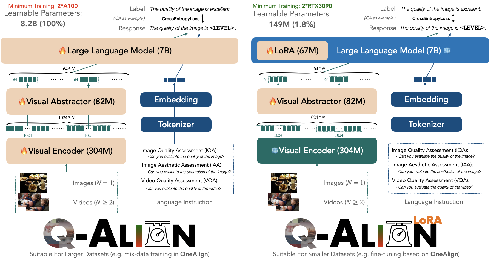

## LoRA Fine-tuning

Training Q-Align / OneAlign is resource-consuming. While it has shown good performance on lots of datasets, if new datasets come, we will still need to adapt it to newer ones. 

*Can we make this add-on adaptation more efficient?*

**Yes, we can.**



We propose a more efficient LoRA (tunes less parameter than LLaVA-style default LoRA), which only needs to tune 149M parameters (1.8\% compared with full version Q-Align), and requires only **2 RTX3090 GPUs** (available to many independent researches). To do this, simply run

```shell
sh scripts/${YOUR_DATASET}_lora.sh
```

The available template dataset options are `agi` (for AGIQA-3K), `cgi` (for CGIQA-6K), `livec` (for LIVE-Challenge), `csiq` (for CSIQ) and `maxwell` (for MaxWell, *videos*). 

Please come with your datasets! (See [here](../playground/data/ft/) for examples on dataset preparation.) 

Note: we do not encourage fine-tuning on datasets that are very similar with the original training corpus of **OneAlign** (might make your adapted model less robust). Just use the **Q-Align**.

To evaluate, please refer to the code below:

- IQA (all excluding MaxWell)

```shell
python q_align/evaluate/iqa_eval_lora_split.py --model-path ${YOUR_MODEL_PATH} --model-base q-future/one-align
```

By default (if `YOUR_MODEL_PATH` is not specified), if will automatically evaluate on the test set of AGIQA-3K (*split 1*).
a
- VQA (MaxWell)

Please modify the `q_align/evaluate/vqa_eval.py` to only evaluate on MaxWell.

```shell
python q_align/evaluate/iqa_eval_lora_split.py --model-path q-future/q-align-maxwell-lora --model-base q-future/one-align
```


### Performance Report

| Dataset | AGIQA-3K | CGIQA-6K | LIVE-C | CSIQ | MaxWell | 
| --- | --- | --- | --- | --- | --- |
| Before LoRA Fine-tuning | 0.802/0.838 | 0.448/0.470 | 0.881/0.894 | 0.881/0.906 |  0.780/0.787 | 
| After LoRA Fine-tuning | **0.880/0.920** | **0.847/0.849** | **0.920/0.934** | **0.929/0.949** | **0.803/0.816** |